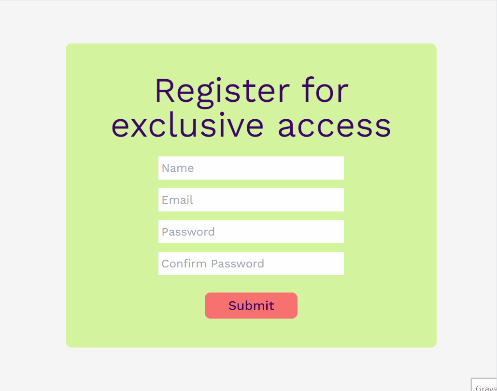

# Simple Form 🗒️

This is a simple [React.js](https://react.dev/)  project showcasing a subscription form using [React-Hook-Form](https://www.react-hook-form.com/) and [Yup](https://www.npmjs.com/package/yup) for form validations. Upon successful submission, a modal is displayed, presenting the entered name and email.

## Technologies ⚙️

## Overview 💻

